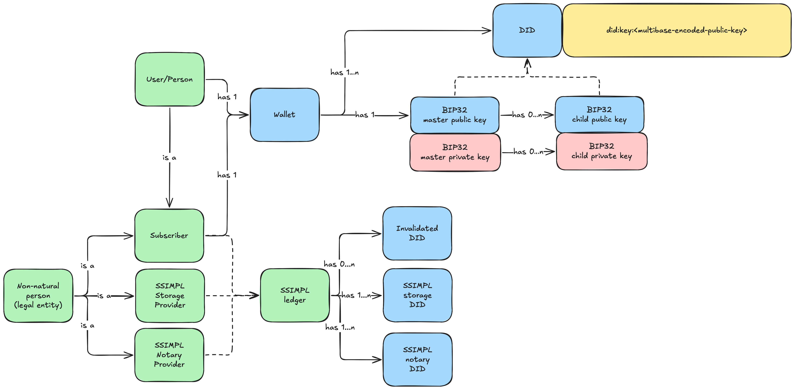

# 1. SSIMPL - Specification

The SSIMPL protocol described in the following specification addresses a few problems that have existed since the early
days of the internet — certainly since Web 2.0:

**How do you keep the owner of the online identity in control of their identity data?**

There have been several iterations of OAuth in the past, one of which (Open ID Connect), was meant to add an
identification layer to a protocol that's otherwise solely used for delegated authorization. This identity layer,
however, has never been implemented in a way that anyone can truly rely on. It requires a certain amount of trust, which
is provided in the form of billion-dollar companies saying "this data belongs to the person who just logged in". But it
adds no guarantees about the validity of those claims. In order to minimize the amount of trust necessary for
identification, it is essential that individuals are capable of managing their digital identity themselves, this is
known as [SSI - Self-Sovereign-Identity](./concepts.md#2-self-sovereign-identity). But a self-issued identity still
isn't worth much if it is not verified.

**How do you verify someone’s digital identity?**

Online, everyone can claim to anyone. For some systems - like social media - that could be fine. But for professional
services, it is of the utmost importance that all parties taking part in any kind of transaction, have a verified
identity shared among the other participants. This
issue has become even more critical with the rise of AI and bots capable of
impersonating individuals with minimal effort.

SSIMPL stands for Self-Sovereign Identity & Mondial Pseudonymous Ledger. Which tells us already quite a bit about its
components.
SSIMPL tries to find a balance between centralised and decentralised systems. It creates a bridge between the physical
and digital worlds through
authority-backed cryptographic proof.
Therefor, implementing SSIMPL requires a trusted central authority (such as a government) that supports some form of
one-time, cryptography-based identification for individuals.

### API reference
DoaToa has implemented the mentioned LEDGER, NOTARY and SUBSCRIPTION capabilities in once instance. You can look at the API reference [here](https://doatoa.io/public/swagger-ui/index.html)



## 1.1 The wallet

The wallet is the core component that holds the owners most important data: their 'claims' and the means to support
those claims. A wallet can be defined as a secure means to store digital data that can only be accessed by its owner.

In the spirit of Open ID Connect, the wallet gives a user all the components needed to authenticate themselves
online at multiple levels:

- Level 0: The DID belongs to a human being.
- Level 1: Level 0 + unverified claims attached to the DID (requested via scope).
- Level 2: Level 1 + verified claims attached to the DID (requested via scope).

Level 0 is sufficient to prove the user is not an AI or bot.
Level 1 may be used when specific, unverified attributes are needed, like an address or a phone number.
Level 2 provides verified claims. The requestor of these claims merely needs to request a certain scope of claims. You,
as the owner then needs to approve this request and send them the requested claims, while signing them with your
wallet.

At the same time, the user will have the ability to cryptographically sign anything they would want to be associated
with. In other words: if they would like to be able to proof they were the original creator of some digital content, all
they would need to do is sign it. Other people could sign it as well, of course, but signature cannot be created using a
past date. So the first one to sign something, always can proof they were the original creator.

- The wallet MUST be able to scan the NFC of an e-passport.
- The wallet MUST perform an [Active-Authentication challenge](./concepts.md#41-icao-doc-9303).
- The wallet MUST request a [SSIMPL notary](#15-ssimpl-notary-capability) to sign their [root claim](data-models.md#root-claim).
- The wallet SHOULD store the DG11, which contains the personal details of the owner which can be the first basic,
  verified claims.
- The wallet MUST be a decentralised [BIP32-compliant](./concepts.md#11-bip32) implementation.
- The wallet MUST be backed-up up with a [BIP39-compliant](./concepts.md#12-bip39) mnemonic phrase (stored offline).
- The wallet MUST be able to store both a root keypair that can be used to sign and verify data and to
  authorize the bearer online, and all claims of the owner.
- The root public key MUST be used to generate a [DID](./concepts.md#3-did) (decentralised Identifier), which is then
  signed by the neutral third party.
- All encoded data, like the cryptographic keys, MUST be encoded
  using [Multibase-encoding](./concepts.md#7-multibase-encoding) to ensure all peers of all possible (future)
  implementations always know which encoding is used.
- The wallet MUST have one or many associated online [SSIMPL subscription providers](#16-ssimpl-subscription-capability) where the 'subscription' can be stored.
- The wallet MUST have the ability to encrypt claims and store them as a 'subscription' object on an online storage.
- The wallet MUST have the ability to generate a JWT (Authentication & UCAN).
- The wallet MUST be able to perform asymmetric encryption in order to share a (or establish a mutual) secret.

Functionally, this would be the way a wallet would be activated:

1. A user installs the wallet
2. The wallet prompts the user for the second line of the MRZ
3. The user provides this line (manually, or by scanning using the camera)
4. The wallet uses this MRZ to perform the NFC scan and extracts all necessary data from the passport
5. The wallet creates the [root claim](data-models.md#root-claim) from the extracted data
6. The wallet creates a BIP39 mnemonic phrase
7. The wallet creates/stores a BIP32 signing keypair based on the mnemonic phrase
8. The wallet presents the user with the related BIP39 mnemonic phrase
9. The wallet then signs the root claim
10. The wallet requests a signature from a SSIMPL notary by presenting the necessary proof
11. The wallet stores the signed root claim
12. 
## 1.2 Means of identification

Online identities are usually based upon a certain amount of trust. In it's worst form this trust is based on the user
filling in their own identity-details in an open form. At its best, it's based on some authority having determined you
are who you say you are. By scanning your passport for example.

In order to establish a truly trustworthy online identity, we must somehow match an actual person to some digital
claims. All this is done in the wallet itself. But to be able to achieve that, there is one requirement:

- All users of the SSIMPL protocol MUST possess a [Standardised e-passport](./concepts.md#4-european-e-passports).

## 1.3 SSIMPL Ledger Capability

In order to protect users from misuse, fraud and identity-theft, each wallet (and specifically the related public keys),
must have a mechanism that allows them to be invalidated. These invalidated public keys must be published to a publicly
accessible, append-only, preferably decentralized, data storage. Anytime someone suspects their identity has been
compromised, they're required to add their public keys to the ledger. This way, everyone can check whether the identity
they're dealing with is actually valid.

The ledger also contains the public keys of so-called [SSIMPL notary](#15-ssimpl-notary-capability)'s. Each entity
that is allowed to sign newly created DIDs. This signature serves as proof that the owner of the DID successfully has
authenticated themselves using
their e-passport.

Finally, the ledger also contains the public keys of so-called [SSIMPL Subscription Capability](#16-ssimpl-subscription-capability)'s. Each entity
that is allowed to temporarily store subscriptions.

- The ledger MUST contain an append-only list for all its invalidated entries.
- The ledger SHOULD contain a list of DID's that provide 'notary' functionality, meaning they can sign initial DID's.
- The ledger SHOULD contain a list of DID's that provide 'storage' functionality, meaning they can sign initial DID's.
- The ledger SHOULD allow updates on the notary list by the owners of the DID's, proven by
  providing a signed version of the DID.
- The ledger SHOULD allow updates on the storage list by the owners of the DID's, proven by
  providing a signed version of the DID.
- The ledger SHOULD be decentralised.

## 1.5. SSIMPL Notary Capability

In order to keep the SSIMPL network trustworthy, certain open-source checkpoints have to be available which can verify
someone's root claims purely based on cryptography. These servers are stateless in essence, but it needs to check the
ledger to see if a DID hasn't been invalidated yet.

- A SSIMPL Notary Capability MUST have their own DID, registered in the ledger as 'notary'
- A SSIMPL Notary Capability MUST have their own signing keypair (implicit, since a DID is already required)
- A SSIMPL Notary Capability MUST have an endpoint which accepts a signed [root claim](data-models.md#root-claim)

## 1.6 SSIMPL Subscription Capability

The ability to establish a verified, digital identity is only part of the equation of an id-wallet. It is essential that
parts of this
identity can be shared with other entities on the internet. A simple example would be 'signing in' on a website.
Originally
these parts of your identity (aka 'Claims'), come from a centralised service which has your profile stored. SSIMPL
offers a completely new perspective. Since you already have the claims stored in your own wallet, there is no need for
an external, centralised service. Instead, the entity interested in your claims shares with you the necessary claims (
aka a '
Scope') to sign in or complete some transaction, a webhook to provide the entity with the web-location of the (
temporary)
subscription on those claims, and, finally, the UCAN token necessary to access that web-locations' endpoint.

This 'subscription' is called that, because the duration that the endpoint is reserved could potentially last longer
than just one transaction. Meaning that you could update the claims if necessary and the other party could fetch the new
data once again. By default, the endpoint is random and must 'self-destruct'. Meaning that neither the owner of the data
nor the other party can interact with it anymore.

- Each online storage MUST delete the subscription after being read once.
- Each storage endpoint MUST send a 200 OK with the subscription the first time it's accessed, and a 204 NO CONTENT (
  without content...) for the duration of the subscription or until the subscription is updated again.
- Each storage endpoint path must remain reserved for the duration of the subscription.
- Each storage endpoint MUST allow updates by the owner for the duration of the subscription.

**Example: Authentication**

With SSIMPL, using a third party to provide another party with your identity data has become obsolete. But how DO we
share our claims with something like a webshop? Let's set up a scenario. We start with these parties:

- Party A. The owner of the identity with their id-wallet.
- Party B. A website (front- and backend), let's say a webshop called "foo-bar.baz".
- Party C. The [SSIMPL Subscription Capability](#16-ssimpl-subscription-capability) used for the (temporary) storage of the 'subscription'.

Pre-requisite: all parties have a DID, signed by a neutral '[notary](#15-ssimpl-notary-capability)' server. For a non-natural
person,
this means a DID from someone inside the legal entity, willing to represent the legal entity.

01. Party A visits Party B, which at some point requires A to identify themselves (to complete an order, for example)
02. Party B has to create a scannable image (like a QR-code), which provides Party
    B [all necessary information](./data-models.md#subscription-request-payload) to
    authenticate Party A
03. Party A uses their wallet to scan the image
04. The wallet of Party A verifies the contents of the payload and shows it to Party A
05. Party A verifies and accepts the request
06. The wallet gathers the necessary claims, combines them into a 'subscription' object, encrypts it, and stores it at
    Party C
07. Party C reserves the web-location for the duration of the subscription
08. Party C responds with the web-location of this subscription
09. The wallet of Party A then creates a UCAN token which grants Party B one-time access to this the specific
    web-location
10. The wallet of Party A sends this token to the destination defined in the original request
11. Party B uses the token to retrieve the subscription
12. Party C deletes the data

In order to support the subscription system, we need to be able to store these subscriptions in a way that anyone can
access them. Peer-to-peer would be the most ideal situation, and with static peers this could be done. But since wallets
are tied to mobile devices, it would become overly complex to force peer-to-peer communication. Each time the claims
tied to a subscription would be updated, the related subscriber would also need to be notified somehow.

The most basic solution is to give each subscription their own gateway endpoint through which it can be read once, and
written (at least once) for the duration of the subscription by the original uploader. A subscriber can then request the
latest version of the subscription at their leisure. If the subscription has not beed updated, they'll receive an empty
204 response, and otherwise the updated subscription.

- A SSIMPL Subscription Capability SHOULD be decentralised
- A SSIMPL Subscription Capability MUST have their own DID, registered in the ledger as 'storage'
- A SSIMPL Subscription Capability MUST have their own signing keypair (implicit, since a DID is already required)

## 1.7 Security

In order to fully implement SSI, a user needs to have full control over their own data. There are several ways to
accomplish this (using a hardware wallet for example), but SSIMPL relies on a somewhat controversial take: most people
have a smartphone and treat it with more respect than their passport. Smartphones these days lack true HSMs (Hardware
Security Modules), which would be the best place for cryptographic material to exist. Due to this (hopefully temporary)
imperfection in smartphones, SSIMPL requires you to use the keystores that exist on devices: Keychain on iOS and the
KeyStore on Android. This introduces a few risks that need to be mitigated:

1. The device is lost/stolen, the related wallet needs to be invalidated. - This is achieved by registering the DID
   on a decentralised ledger. It would require you use the mnemonic phrase on a new device to re-create your wallet,
   then invalidate it. The user can then create a new wallet
   again.
2. A user switches devices, the wallet needs to be re-created. - The mnemonic phrase can be used to re-create the old
   wallet. Always do take care to either delete the wallet from the device, or to factory-reset the device.
3. The mnemonic phrase is lost/stolen. - The user will need to invalidate their current DID
   and create a new wallet (which will also mean the user gets a new mnemonic phrase)
4. A user loses both their mnemonic phrase and their phone. - **This scenario should be prevented at all costs, since
   everything relies on that mnemonic phrase. And no mitigation exists for this scenario.** It is advised to use a (
   maybe even redundant) paper/metal backup to keep the mnemonic phrase safe.

[//]: # (## 1.4 Peer-to-peer)

[//]: # ()

[//]: # (In order to promote a truly trustless environment, all essential communication - like the transfer of identity-related)

[//]: # (data - must be done p2p. The client-server model must only be used for setting op connections between peers. So the)

[//]: # (server never receives any sensitive data, but merely acts as a guide to find other peers.)

[//]: # (## 1.2 WebRTC)

[//]: # ()

[//]: # (In order to be able to establish direct communication between peers through WebRTC, a Signal-, STUN- and TURN-server are)

[//]: # (required. These are used for peers to locate each other, after which, further communication is truly p2p.)

[//]: # ()

[//]: # (## 1.3 IPFS)

[//]: # ()

[//]: # (Some details need to be stored in a way that anyone can access them, preferably without a centralised server.)

[//]: # (The [IPFS]&#40;./concepts.md#112-ipfs&#41;)

[//]: # (is a good candidate for this. The IPFS needs to host a file that contains all registered, invalidated/expired DIDs &#40;the)

[//]: # (ledger&#41;.)

[//]: # (Every time another version of this file is uploaded, a pointer-file also needs to be updated. This pointer-file is a)

[//]: # (file)

[//]: # (containing static data whose metadata is updated to point to the new version of the ledger. To register, one needs to)

[//]: # (submit a "root claim", which ties the identity's DID to the document)

[//]: # (they used to authenticate themselves. Similarly, this same ledger-entry needs to be updated for invalidations. Each)

[//]: # (instance integrating with the IPFS needs to implement these business rules:)

[//]: # ()

[//]: # (1. A user can only append entries if the entry doesn't exist yet, &#40;composite key of DID + identityDocumentHash&#41;.)

[//]: # (2. A user can only invalidate their own root claim if it exists.)

[//]: # (3. An invalidated root claim cannot be altered again.)

[//]: # ()

[//]: # (These rules must be implemented by checking the signature for each entry against the provided DID.)

[//]: # ()

[//]: # (##### rootClaim:)

[//]: # ()

[//]: # (&#40;The choice to use JSON is arbitrary&#41;)

[//]: # ()

[//]: # (```json)

[//]: # ({)

[//]: # (  "data": {)

[//]: # (    "did": "",)

[//]: # (    "identityDocumentHash": "",)

[//]: # (    "createdAt": "2025-04-09T10:15:30+07:00.",)

[//]: # (    "invalidatedAt": null)

[//]: # (  },)

[//]: # (  "signature": {)

[//]: # (    "publicKey": "string",)

[//]: # (    "algorithm": "string",)

[//]: # (    "value": "string")

[//]: # (  },)

[//]: # (  "signer": "string")

[//]: # (})

[//]: # (```)

[//]: # ()

[//]: # (##### identityDocumentHash:)

[//]: # ()

[//]: # (&#40;The choice to use JSON is arbitrary&#41;)

[//]: # ()

[//]: # (```js)

[//]: # (const identityDocumentHash = sha256&#40;)

[//]: # (    JSON.stringify&#40;)

[//]: # (        {)

[//]: # (            "nationality": "DUTCH",)

[//]: # (            "dateOfBirth": "30051988",)

[//]: # (            "firstNames": "JOHN HARVEY",)

[//]: # (            "lastName": "DOE",)

[//]: # (            "documentNumber": "ABC12345XYZ",)

[//]: # (            "documentType": "P",)

[//]: # (            "documentExpiryDate": "01012050")

[//]: # (        })

[//]: # (    &#41;)

[//]: # (&#41;)

[//]: # (```)

[//]: # ()

[//]: # (---)

[//]: # (# 2. DoaToa - a SSIMPL implementation)

[//]: # ()

[//]: # (DoaToa &#40;Decentralised Open Auth & Trusted Open Auth&#41; is the first SSIMPL implementation created. It consists of a)

[//]: # (client-side app &#40;the id-wallet&#41; and a few)

[//]: # (stateless microservices necessary to help set up decentralised communication and sharing of data. These microservices,)

[//]: # (while being centralised components, are meant to be 'the first of many' open-source interchangeable implementations. The)

[//]: # (same goes for the id-wallet. As long as the specification is followed, multiple implementations of both the centralised)

[//]: # (components and the wallet, should be able to co-exist.)

[//]: # ()

[//]: # (## 2.1 The Wallet)

[//]: # ()

[//]: # (The DoaToa id wallet offers an entire implementation of the SSIMPL client-side specification.)

[//]: # ()

[//]: # (## 2.2 Mondial Pseudonymous Ledger)

[//]: # ()

[//]: # (The ledger described in the specification has certain requirements tied to it. For example: it should be decentralised,)

[//]: # (and it must be append-only. Research for the right technology is still ongoing. We've had successful experiments with)

[//]: # (the IPFS. But blockchains like Arweave are still undergoing investigation. At the moment, a simple GitLab repository is)

[//]: # (used to store the ledger. Since entities that are allowed to mutate the ledger are limited, and DoaToa is still in the)

[//]: # (POC phase, this ought to be enough.)

[//]: # ()

[//]: # (## 2.3 Security)

[//]: # ()

[//]: # (In order to fully implement SSI, a user needs to have full control over their own data. There are several ways to)

[//]: # (accomplish this &#40;using a hardware wallet for example&#41;, but DoaToa relies on a somewhat controversial take: most people)

[//]: # (have a smartphone and treat it with more respect than their passport. Smartphones these days lack true HSMs &#40;Hardware)

[//]: # (Security Modules&#41;, which would be the best place for cryptographic material to exist. Due to this &#40;hopefully temporary&#41;)

[//]: # (imperfection in smartphones, DoaToa uses the keystores that exist on devices: Keychain on iOS and the KeyStore)

[//]: # (on Android. This introduces a few risks that need to be mitigated:)

[//]: # ()

[//]: # (1. The device is lost/stolen, the related wallet needs to be invalidated. - This is achieved by registering the DID)

[//]: # (   on a decentralised ledger, stored on the IPFS. DoaToa provides this functionality. It would require you use the)

[//]: # (   mnemonic phrase on a new device to re-create your wallet, then invalidate it. The user can then create a new wallet)

[//]: # (   again.)

[//]: # (2. A user switches devices, the wallet needs to be re-created. - The mnemonic phrase can be used to re-create the old)

[//]: # (   wallet. Always do take care to either delete the wallet from the device, or to factory-reset the device.)

[//]: # (3. The mnemonic phrase is lost/stolen. - The user will need to invalidate their current DID)

[//]: # (   and create a new wallet &#40;which will also mean the user gets a new mnemonic phrase&#41;)

[//]: # (4. A user loses both their mnemonic phrase and their phone. - **This scenario should be prevented at all costs, since)

[//]: # (   everything relies on that mnemonic phrase.** It is advised to use a &#40;maybe even redundant&#41; paper/metal backup to keep)

[//]: # (   the mnemonic phrase safe.)

[//]: # (## 2.4 Centralised component)

[//]: # ()

[//]: # (In order to establish WebRTC connections, some centralised components are required for peers to find each other. As soon)

[//]: # (as the connection is created, all data will be moved directly from peer to peer. So there is no need to entrust any)

[//]: # (server with your data.)

[//]: # ()

[//]: # (In order to store data on the IPFS while leveraging metadata to 'update' files, a central server is also required.)

[//]: # ()

[//]: # (Finally, in order to ensure every SSIMPL DID out there is actually from the ones they claim to be, DoaToa can be)

[//]: # (presented with the cryptographic material coming from your passport along with the DID. If DoaToa can verify this)

[//]: # (material, the DID will be signed by DoaToa. Verification of this material goes as follows:)

[//]: # ()

[//]: # (1. The passport contains all the means for an Active Authentication challenge, which needs to be passed. This challenge)

[//]: # (   makes sure the cryptographic material actually comes from the passport in the hands of the owner.)

[//]: # (2. The passport contains a hash list of all the data on it. This hash list is signed by an authorised party and the)

[//]: # (   related public key can be found in the public ICAO master list. DoaToa checks if this is the case and verifies the)

[//]: # (   signature.)

[//]: # ()

[//]: # (This limited set of features is provided by DoaToa, but could relatively easily be implemented by other enthusiasts. The)

[//]: # (only requirements are that they are open-sourced. Each provider of these features will require a DID as well. You can)

[//]: # (request DoaToa to register your DID as a provider.)